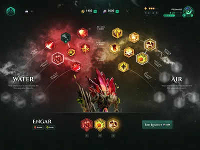
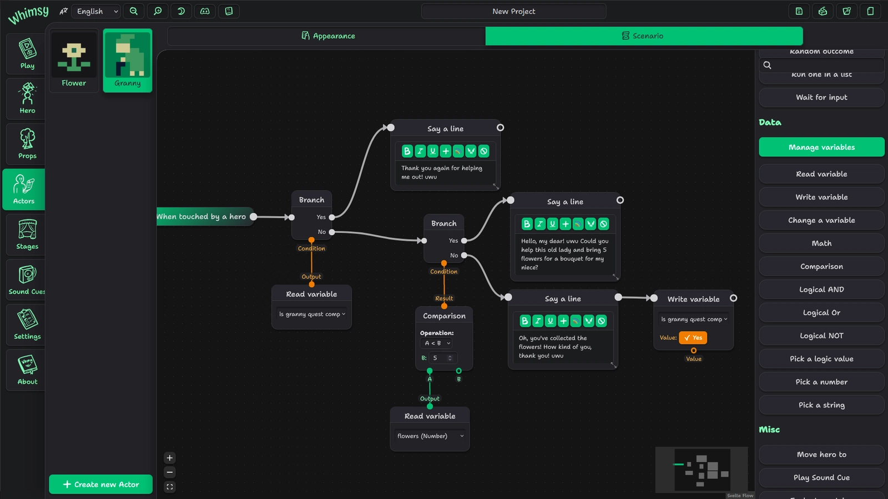

# Basisgame – Das Fundament des RaidSimulators

Bevor über Features, Systeme oder Werkzeuge gesprochen wird, braucht es eine klare Antwort auf eine einfache Frage:
Was ist das Spiel im Kern?

Das Basisgame des RaidSimulators ist kein MMO, kein Sandbox-Survival und kein klassisches RPG. Es ist bewusst kleiner gedacht – aber strategisch so angelegt, dass es wachsen kann. Der Fokus liegt auf Raid-Gameplay, nicht auf einer offenen Welt oder endlosen Nebenbeschäftigungen.

Das Ziel dieses Basisgames ist es, einen spielbaren, in sich geschlossenen Kern zu schaffen, der:
• im Singleplayer funktioniert,
• taktische Tiefe bietet,
• User-Content erlaubt,
• und technisch bereits den Weg für Multiplayer vorbereitet.

---

## Warum ein RaidSimulator?

Raids sind eines der komplexesten, aber auch befriedigendsten Spielformate überhaupt:
• klare Rollenverteilung
• anspruchsvolle Bossmechaniken
• Lernkurven durch Scheitern
• Kooperation statt Reflex-Gewinne

Gleichzeitig sind Raids fast immer an MMOs gebunden – mit all ihren Nachteilen: hoher Produktionsaufwand, Serverkosten, Content-Druck und Balancing-Hölle.

Der RaidSimulator dreht diesen Ansatz um:

> Er bringt das Raid-Erlebnis in ein Singleplayer-Spiel – ohne es zu trivialisieren.

---

## Inspirationen und bewusste Entscheidungen

Das Basisgame zieht seine Ideen aus drei sehr unterschiedlichen Richtungen:
	•	Block-basierte Einfachheit
Inspiriert von Hytale: Die Welt besteht aus klaren, verständlichen Bausteinen. Blöcke sind nicht nur Optik, sondern das Fundament für Leveldesign, Modding und User-Dungeons.
	•	Raid-Denke statt Klassen-Zwang
Inspiriert von klassischen MMORPGs wie WoW: Rollen sind entscheidend – Klassen nicht. Builds entstehen aus Skills, Ausrüstung und Entscheidungen, nicht aus der Charaktererstellung.
	•	User-Scripting als Feature, nicht als Hack
Inspiriert vom Roulette-Strategie-Simulator: Spieler dürfen Regeln beeinflussen. Nicht den Core-Code, sondern das Verhalten von Systemen – kontrolliert, sandboxed und reproduzierbar.

Diese drei Stränge laufen im Basisgame zusammen.

--- 

## Singleplayer zuerst – aber nicht „Singleplayer-only“

Das Spiel erscheint als Singleplayer-Titel. Punkt.
Aber: technisch wird von Anfang an ein Serverprozess genutzt – selbst lokal.

Das bedeutet:
	•	Spielregeln laufen serverseitig
	•	KI, Combat, Loot und Logik sind autoritativ
	•	der Client ist Darstellung und Eingabe

Für den Spieler ist das unsichtbar. Für die Architektur ist es entscheidend.
Multiplayer ist damit keine Designwende, sondern eine Erweiterung.

--- 

## UserDesigned Dungeons als Herzstück

Content entsteht im RaidSimulator nicht nur durch Entwicklerarbeit, sondern durch Dungeons als Pakete:
• Layout (Räume, Blöcke, Trigger)
• Encounters (Boss-Logik, Events, Phasen)
• optionale Assets
• optionale Companion-Presets

Das Basisgame muss deshalb nicht riesig sein. Es muss offen sein.
Ein guter Dungeon ist wertvoller als zehn generische.

---

## Reduktion als Prinzip

Ein wichtiger Teil des Basisgames ist das bewusste Weglassen.
Nicht alles, was später möglich wäre, gehört in den ersten Entwurf:
• keine offene Welt
• kein globales Economy-System
• kein Housing
• kein PvP
• kein „Endlos-Crafting“

Stattdessen:
• ein klarer Gameplay-Loop
• ein Raid-taugliches Kampfsystem
• Companions als spielmechanisches Rückgrat
• Modding von Anfang an mitgedacht

---

## Worum es in diesem Kapitel geht

Dieses Kapitel beschreibt nicht das fertige Spiel, sondern den Startpunkt:
• Welche Systeme braucht ein RaidSimulator wirklich?
• Welche Architekturentscheidungen sparen später Zeit, Geld und Nerven?
• Wie viel Freiheit kann man dem Spieler geben, ohne das Spiel zu verlieren?

Alles Weitere – Skilltrees, Companions, Blueprints, User-Dungeons – baut auf diesem Fundament auf.

Und ja:
Ein Teil davon wird später gestrichen werden.
Nicht weil es falsch war – sondern weil Zeit und Budget endlich sind.

Aber ohne dieses Basisgame gäbe es nichts, was man sinnvoll kürzen könnte.

---

## Companions, Skilltrees & visuelle Logik (Blueprints statt Code)

Im Basisgame des RaidSimulators sollen Spieler nicht nur ihren eigenen Charakter entwickeln, sondern auch ihre Begleiter formen. Companions sind kein statisches Beiwerk, sondern ein zentraler Bestandteil des Gameplays – insbesondere im Singleplayer. Sie übernehmen Rollen, reagieren auf Bossmechaniken und machen Raids überhaupt erst solo spielbar.

Der entscheidende Punkt dabei: Companions werden konfiguriert, nicht programmiert.

---

## Skilltrees: Was ein Companion kann

Jeder Companion besitzt einen eigenen Skilltree. Dieser definiert nicht sein Verhalten, sondern seine Fähigkeiten und Möglichkeiten:
	•	freigeschaltete Skills (z. B. Heilzauber, Taunts, Support-Auren)
	•	passive Boni und Traits
	•	Priorisierung von Attributen
	•	Ausrüstung und Modifikatoren
	•	grobe Rollen-Tendenzen (z. B. defensiv, unterstützend, aggressiv)

Der Skilltree ist bewusst datengetrieben gehalten. Er ist übersichtlich, gut balancierbar und leicht erweiterbar. Für den Spieler fühlt er sich vertraut an – ähnlich wie Talentbäume in klassischen RPGs oder MMORPGs – ohne ihn in starre Klassen zu zwingen.

Der Skilltree beantwortet also die Frage:
„Was darf dieser Companion grundsätzlich tun?“

---

## Der Companion-Brain: Wie ein Companion entscheidet

Die eigentliche Intelligenz eines Companions steckt jedoch nicht im Skilltree, sondern in seinem sogenannten Brain. Dieses Brain beschreibt das Entscheidungsverhalten während eines Kampfes:
	•	Wann wird geheilt?
	•	Wer bekommt Aggro?
	•	Welche Fähigkeit hat Priorität?
	•	Wann wird ausgewichen oder repositioniert?
	•	Wie wird auf Boss-Events reagiert?

Anstatt diese Logik über Textskripte (z. B. SMS) zu definieren, wird sie im Basisgame über visuelle Blueprints abgebildet.

---

## Blueprints statt Code

Blueprints sind visuelle Logikgraphen:
Knoten repräsentieren Bedingungen, Abfragen oder Aktionen, Verbindungen definieren den Ablauf.

Beispiele:
	•	„Wenn ein Verbündeter unter 40 % Leben fällt → prüfe, ob Heal bereit ist → wirke Heal“
	•	„Wenn Boss eine Fähigkeit kanalisiert → unterbrich oder bewege dich aus der Zone“

Dieses System hat mehrere Vorteile:
	•	Niedrige Einstiegshürde: Kein Code, keine Syntaxfehler
	•	Hohe Ausdrucksstärke: Komplexe Logik bleibt visuell nachvollziehbar
	•	Raid-tauglich: Prioritäten, Cooldowns und Trigger lassen sich sauber abbilden
	•	Modding-freundlich: User können eigene Companions und Verhaltensweisen entwerfen

Intern wird ein Blueprint nicht „live interpretiert“, sondern in eine einfache, deterministische Repräsentation übersetzt, die vom Spielserver ausgeführt wird. So bleibt das System stabil, performant und später multiplayerfähig.

---

## Server-Autorität von Anfang an

Auch im Singleplayer läuft das Spiel technisch als Client-Server-Modell. Der Server – lokal gestartet – entscheidet über:
	•	Kampflogik
	•	KI-Updates
	•	Skill-Ausführung
	•	Cooldowns und RNG
	•	Blueprint-Auswertung

Die Companions „denken“ also nicht im Client, sondern im Serverprozess. Das hat zwei große Vorteile:
	1.	Determinismus: Verhalten ist reproduzierbar und fair.
	2.	Zukunftssicherheit: Multiplayer erfordert später keine Neuentwicklung der KI.

Blueprints laufen dabei in festen Update-Schritten und unter klaren Budget-Limits. Endlosschleifen oder eskalierende Logik sind ausgeschlossen.

---

## Skilltree und Blueprint: bewusst getrennt

Ein wichtiger Designentscheid ist die klare Trennung zwischen Fähigkeiten und Verhalten:
	•	Der Skilltree bestimmt, was möglich ist.
	•	Der Blueprint bestimmt, wann und wie es genutzt wird.

Diese Trennung macht das System:
	•	leichter verständlich
	•	besser balancierbar
	•	robuster gegen Exploits
	•	angenehmer für Designer und Spieler

Ein Companion kann denselben Skilltree besitzen, aber durch unterschiedliche Blueprints völlig anders spielen.

---

## ImGui als Editor-Fundament

Für den Blueprint-Editor werden vorhandene ImGui-Widgets und Node-Editor-Konzepte genutzt. Dadurch entsteht ein flexibles, editor-ähnliches Interface direkt im Spiel oder im Dungeon-Designer:
	•	Nodes für Bedingungen, Abfragen und Aktionen
	•	Verbindungen für Entscheidungsflüsse
	•	Parameter per Slider, Dropdown oder Checkbox
	•	Live-Debugging denkbar (später)

Das Ziel ist kein Voll-IDE-Monster, sondern ein verständliches Werkzeug, mit dem Spieler ihre Companions „trainieren“ können.

---

## Fazit für das Basisgame

Companions sind im RaidSimulator keine simplen NPCs. Sie sind:
	•	konfigurierbare Builds
	•	visuell programmierbare Verhaltenssysteme
	•	tragende Säulen des Solo-Raid-Gameplays

Durch Skilltrees und Blueprints entsteht ein System, das sowohl Einsteiger als auch fortgeschrittene Spieler abholt – und gleichzeitig perfekt in eine spätere MMO-Architektur hineinwächst.